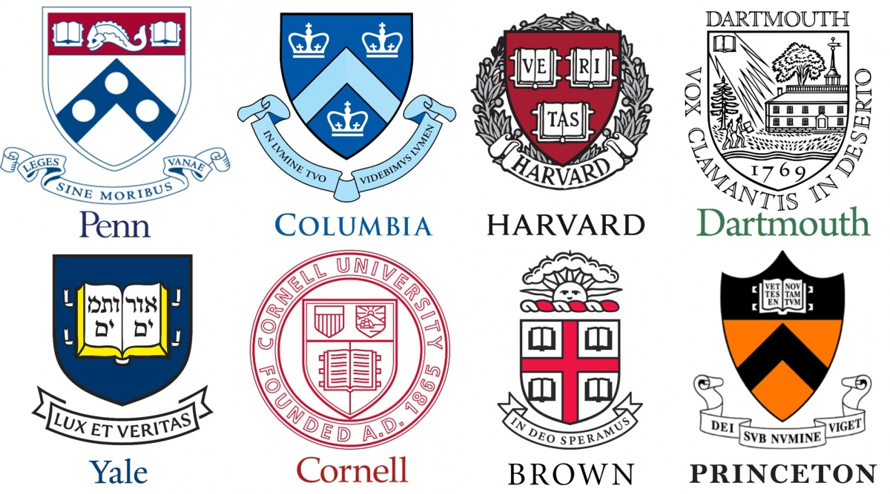

# Fall 2017
# Project 1: What did the presidents say at their inauguation?



### [Project Description](doc/)
*Inspiration: *
"Why do you study so hard, kid? What's your dream?" If you were asked this question when you were a child, many of you may say it out proudly that "Because I want to be a president when I grow up!" Maybe most of us will think the education level is really important for being a president.

##Is the education level related to U.S. president's performance in inaugural speech?
In other words, do those U.S. presidents with higher education level can deliver more comprehansible and admirable inaugural speeches with longer and more complex sentences? Let's find out.

* Project title: Does presidents with higer education level deliver more complex inaugural speech?  
* This project is conducted by *Xin Gao, Columbia UNI: xg2249*

### Project summary:  
I approach the question by first, quantify the concept of the "education level". I collected the education background of each president, and if he had a bachelor degree, he can get 1 point. If he had a master degree, then he can get another 1 point. If his univerisity belongs to League Ivy, then he can add 1 more point. So we can seperate the presidents into 4 education levels with score 0,1,2,3.  
Then we begin to compare among these four goups. I compared the sentence length of inaugural speeches grouped by presidents' education level . Also, I compared Tense distribution of inaugural speeches and percent of sentences referred to each tense. Additionally, I plotted a comparison wordcloud to show the difference of important words across the 4 groups. And I calculated and plotted the word frequency within each group. Finally, I explored the relationship between speech topic and education level.

### Conclusion:
 * Interesting fact1: We find that the most of those presidents with lowest education level(0) used a lot of longer sentences. However, those presidents who used all short sentences in their inaugural speech belong to the high edcation levels (2 and 3). That's weird, right? Maybe presidents with higher education level wanted to be more easygoing and got closer to general public, so they just used short sentences to win.
 * Interesting fact2: We can see that most of Presidents, no matter how their education backgrounds are, did change their tense very often during the inauguration.
 * Interesting Fact 3: Presidents with lower education level included relatively more simple past tense in their speech while presidents with higher education level included relatively more simple present tense in their speech. Maybe presidents with better education like discussing "now" more than "past".
* Interesting Fact 4: Presidents with lower education level considered more about "government" and "people". But those presidents with better education background considered more about "world" and "nation", and they used a lot of "must".  
* Interesting Fact 5: We can see that most of those presidents with similar education level had similar topic in their inauguration.
 
### Output:
#####I have many great plots! You can either check them in the output file or run them using rmd code in the doc file.
  
Following [suggestions](http://nicercode.github.io/blog/2013-04-05-projects/) by [RICH FITZJOHN](http://nicercode.github.io/about/#Team) (@richfitz). This folder is orgarnized as follows.

```
proj/
├── lib/
├── data/
├── doc/
├── figs/
└── output/
```
To reproduce the result:
Main result can be reproduced from the proj1.Rmd file in the doc forder.  


*Thank you for reading!!!*


