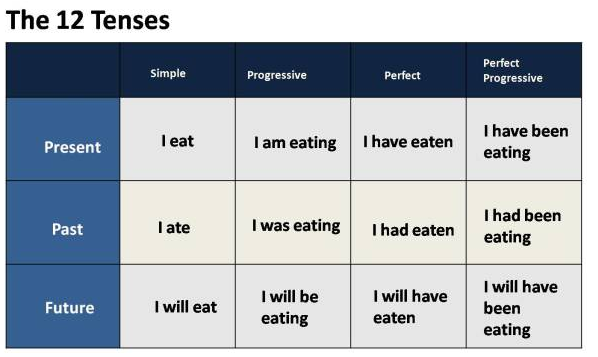

+ Project title: Does presidents with higer education level deliver more complex inaugural speech?
+ This project is conducted by *Xin Gao, Columbia UNI: xg2249*


# Step 1: Data Processing 

I approach the question by first, quantify the concept of the "education level". I collected the education background of each president, and if he had a bachelor degree, he can get 1 point. If he had a master degree, then he can get another 1 point. If his univerisity is one of the League Ivy, then he can add 1 more point. So we can seperate the presidents into 4 education levels with score 0,1,2,3. 

**New Function**:
Function Maxent_POS_Tag_Annotator()  will do the part-of-speech tagging, a process of marking up a word in a text (corpus) as corresponding to a particular part of speech, based on both its definition and its context.  
Function sentTag assigns tense to each sentence in the text based on tense principle.

**Notice**:Since the final dataframe would take about 90 minutes to get, I wrote them into csv.  

```{r, message=FALSE, warning=FALSE}
packages.used=c("rvest", "tibble", "qdap", 
                "sentimentr", "gplots", "dplyr",
                "tm", "syuzhet", "factoextra", 
                "beeswarm", "scales", "RColorBrewer",
                "RANN", "topicmodels","NLP","openNLP","openNLPmodels.en")

# check packages that need to be installed.
packages.needed=setdiff(packages.used, 
                        intersect(installed.packages()[,1], 
                                  packages.used))
# install additional packages
if(length(packages.needed)>0){
  install.packages(packages.needed, dependencies = TRUE)
}

# load packages
library("rvest")
library("tibble")
library("qdap")
library("sentimentr")
library("gplots")
library("dplyr")
library("tm")
library("syuzhet")
library("factoextra")
library("beeswarm")
library("scales")
library("RColorBrewer")
library("RANN")
library("topicmodels")
library("NLP")
library("openNLP")
library("openNLPmodels.en")

#Inauguaral speeches: scrap speech URLs from <http://www.presidency.ucsb.edu/>.
#main.page <- read_html(x = "http://www.presidency.ucsb.edu/inaugurals.php") #xml2 package
# Get link URLs
# f.speechlinks is a function for extracting links from the list of speeches. 
#inaug=f.speechlinks(main.page) #.GlobalEnv
#inaug$links= as.Date(inaug[,1], format="%B %e, %Y")
#inaug=inaug[-nrow(inaug),] # remove the last line, irrelevant due to error.
#write.csv(inaug,"../data/inaug.csv")
inaug<-read.csv("../data/inaug.csv")
inaug.list<-read.csv("../data/inauglist.csv", stringsAsFactors = FALSE)
edu<-read.csv("../data/education background.csv",header = T)
for(i in 1:nrow(inaug.list)){
  inaug.list$edulevel[i]<-edu$highlevel[which(edu$President==inaug.list$X...President[i])]
}

#We assemble all scrapped speeches into one list. Note here that we don't have the fulltext
#speech.list=cbind(inaug.list, inaug)

#We scrap the main text part of the transcript's html page. For simple html pages of this kind,  [Selectorgadget](http://selectorgadget.com/) is very convenient for identifying the html node that `rvest` can use to scrap its content. 
#speech.list$fulltext=NA
#for(i in seq(nrow(speech.list))) {
#    text <- read_html(speech.list$urls[i]) %>% # load the page
#    html_nodes (".displaytext") %>% # isloate the text #rvest
#    html_text() # get the text
#    speech.list$fulltext[i]=text
#}
#write.csv(speech.list,"../data/speech.list.csv")
speech.list<-read.csv("../data/speech.list.csv")
# generate list of sentences

#if("ggplot2" %in% (.packages())){
#  detach("package:factoextra", unload=TRUE)
#  detach("package:ggplot2", unload=TRUE) 
#}
#sentence.list=NULL
#for(i in 1:nrow(speech.list)){
#  sentences=sent_detect(speech.list$fulltext[i],
#                        endmarks = c("?", ".", "!", "|",";")) #qdap
#  if(length(sentences)>0){
#    emotions=get_nrc_sentiment(sentences) #syuzhet
#    word.count=word_count(sentences)
#    emotions=diag(1/(word.count+0.01))%*%as.matrix(emotions)
#    tense=sentTag(sentences)
#    sentence.list=rbind(sentence.list, 
#                        cbind(speech.list[i,-ncol(speech.list)],
#                              sentences=as.character(sentences), 
#                              word.count,
#                              tense,
#                              emotions,
#                              sent.id=1:length(sentences)
#                              )
#    )
#  }
#}
#write.csv(sentence.list,"finaldata.csv")

sentence.list<-read.csv("../data/finaldata.csv")

```

# Step 2: Start to compare among four groups.

##1. Compare the number of presidents in each cluster and draw a bar plot.
```{r,fig.width = 6, fig.height = 6}
#pdf("../output/number.pdf",width=6,height=6)
ggplot(as.data.frame(table(inaug.list$edulevel[inaug.list$Term==1]))) + 
  aes(x=Var1,y=Freq) + 
  geom_bar(stat="identity",aes(fill=Var1),alpha=0.8) + 
  ylim(0,15) +  
  labs(title="Barplot for education levels",
       x="Education level score",y="Number of presidents")

```


## 2. Compare sentence length distribution of different speeches grouped by presidents' education level.

*Assumption: Those presidents with higher education level may use more long sentences.*

```{r,fig.width = 7, fig.height = 7}  
sentence.list<-read.csv("../data/finaldata.csv")
sentence.list.sel= na.omit(sentence.list[sentence.list$Term==1,])
sentence.list.sel$File=factor(sentence.list.sel$File)
sentence.list.sel$FileOrdered=reorder(sentence.list.sel$File, 
                                  sentence.list.sel$word.count, 
                                  mean, 
                                  order=T)

tb1=as.data.frame(levels(sentence.list.sel$FileOrdered))
names(tb1) = "File"
tb2 =unique(sentence.list.sel[,c(3,9)])
for(i in 1:nrow(tb1)){
  tb1$edulevel[i]<-tb2$edulevel[which(tb2$File==tb1$File[i])]
}


MyColor<-c("gold","darkorange2","brown1","brown4")
eduColor<-factor(tb1$edulevel ,levels = 0:3 ,labels = MyColor)

#pdf("../output/sentencelength.pdf",width=8,height=8)
par(mar=c(4, 11, 2, 2))
beeswarm(word.count~FileOrdered, 
         data=sentence.list.sel,
         horizontal = TRUE,
         pch=16, 
         col =as.character(eduColor),
         cex=0.55, cex.axis=0.8, cex.lab=0.8,
         spacing=5/nlevels(sentence.list.sel$FileOrdered),
         las=2, ylab="", xlab="Number of words in a sentence.",
         main="Inaugural Speeches") #beeswarm
legend("topright",legend=levels(factor(tb1$edulevel)),fill=MyColor,cex=1)


```

#### Interesting fact1: We find that the most of those presidents with lowest education level(0) used a lot of longer sentences. However, those presidents who used all short sentences in their inaugural speech belong to the high edcation levels (2 and 3). That's weird, right? Maybe presidents with higher education level wanted to be more easygoing and got closer to general public, so they just used short sentences to win.


## 3. Compare tense distribution of different speeches grouped by presidents' education level. 
English has three main tenses: present, past, and future, and each of them has sub-tenses. Here are the twelve English tenses:

```{r,fig.width = 7, fig.height = 7}
sentence.list$File=factor(sentence.list$File)

sentence.list$FileOrdered2=reorder(paste(sentence.list$File,sentence.list$edulevel), 
                                  sentence.list$sent.id, 
                                  max, 
                                  order=T)
par(mar=c(4, 11, 2, 2))

# Assign color to each tense 
Tense<-c("Simple Past", "Past Continuous", "Past Perfect", "Past Perfect Continuous", "Simple Present", "Present Continuous", "Present Perfect", "Present Perfect Continuous", "Simple Future","Future Continuous","Future Perfect","Undefined")
MyColors<-c("gold", "greenyellow","green","cyan4","dodgerblue","brown","hotpink", "purple","yellow","orange","firebrick", "grey")
tenseColor<-factor(sentence.list$tense, levels = Tense, labels = MyColors)
# Beeswarm Plot to show the changes of tense during their inauguration.
#pdf("../output/tensedistribution.pdf",width=8,height=8)
beeswarm(sent.id~FileOrdered2, 
         data=sentence.list,
         horizontal = TRUE,
         pch=16, pwcol=as.character(tenseColor),
         cex=1, cex.axis=1, cex.lab=1,
         spacing=5/nlevels(sentence.list$FileOrdered),
         las=2, ylab="", xlab="Sentence ID",
         main="Inaugural Speeches")
legend("bottomright", legend = Tense,
         title = "Tense", pch = 16, cex=.8, col = MyColors)

```

#### Interesting fact2: We can't see the differences among 4 groups of presidents clearly from this graph. However, we can see that most of Presidents, no matter how their education backgrounds are, did change their tense very often during the inauguration! We can also find that those presidents who haven't attended a university also like making long speech.


## 4. Compare the percent of sentences referred to each tense for group0 nd group3.
```{r,fig.width = 8, fig.height = 6}
list0<-sentence.list[sentence.list$edulevel==0,]
count0<-table(list0$tense,factor(list0$File))
count0<-prop.table(count0,2)
count0<-count0[match(Tense,rownames(count0)),]


list3<-sentence.list[sentence.list$edulevel==3,]
count3<-table(list3$tense,factor(list3$File))
count3<-prop.table(count3,2)
count3<-count3[match(Tense,rownames(count3)),]

(apply(count3,1,mean)-apply(count0,1,mean))*100


#pdf("../output/percentofeachtense.pdf",width=8,height=6)
par(mfrow=c(1, 2), mar=c(9, 2, 4, 7), oma=c(1,1,1,1))
barplot(count0, main="low education level", ylab="Percentage",
        col=MyColors,bty='L',
        las=2,cex.axis = 0.8, cex.names=0.8)
barplot(count3, main="high education level", ylab="Percentage",
        col=MyColors,bty='L',
        las=2,cex.axis = 0.8, cex.names=0.8)
par(xpd=TRUE)
legend(9.6,1,legend = Tense,
         title = "Tense", cex=0.6, fill = MyColors)
```

#### Interesting Fact 3: Presidents with lower education level included relatiely more simple past tense in their speech while presidents with higher education level included relatively more simple present tense in their speech. Maybe presidents with better education like discussing "now" more than "past".


  

## 5. Compare the wordcloud to show the difference of important words across the clusters.

Using the tools of wordcloud package, we can calculate a comparison wordcloud to show the difference of important words across the clusters. In this notebook, we give three results with maximum words of 200 and 1000 respectively.
```{r, echo=TRUE, message=FALSE, warning=FALSE}
packages.used=c("tm", "wordcloud", "RColorBrewer", "reshape", "ggplot2",
                "dplyr")

# check packages that need to be installed.
packages.needed=setdiff(packages.used, 
                        intersect(installed.packages()[,1], 
                                  packages.used))
# install additional packages
if(length(packages.needed)>0){
  install.packages(packages.needed, dependencies = TRUE,
                   repos='http://cran.us.r-project.org')
}

library(tm)
library(wordcloud)
library(RColorBrewer)
library(dplyr)
library(reshape)
library(ggplot2)

unique_edulevel <- sort(unique(speech.list$edulevel))
dataset_merge <- sapply(unique_edulevel ,function(label) list(speech.list[speech.list$edulevel %in% label,ncol(speech.list)] ) )
ff <- lapply(dataset_merge, function(x) Corpus(VectorSource( toString(x) ))) 
ff.all <- ff[[1]]
for (i in 2:length(unique_edulevel )) {
  ff.all<- c(ff.all,ff[[i]])
}

ff.all<-tm_map(ff.all, stripWhitespace) #remove extra white space
ff.all<-tm_map(ff.all, content_transformer(tolower)) #convert all letters to the lower case
ff.all<-tm_map(ff.all, removeWords, stopwords("english")) # remove [stop words]
ff.all<-tm_map(ff.all, removeWords, character(0)) #removed empty words due to formatting errors
ff.all<- tm_map(ff.all, removePunctuation)#remove punctuation
ff.all<- tm_map(ff.all, removeNumbers)
ff.all<- tm_map(ff.all, function(x) removeWords(x,stopwords("english")))
words_to_remove <- c("said","from","what","told","over","more","other","have","last",
                     "with","this","that","such","when","been","says","will","also",
                     "where","why","would","today")
ff.all<- tm_map(ff.all, removeWords, words_to_remove)

dtm.all<-TermDocumentMatrix(ff.all) #compute the [Document-Term Matrix (DTM)]
dtm_mat <- as.matrix(dtm.all)
colnames(dtm_mat) <- unique_edulevel 
index <- as.logical(sapply(rownames(dtm_mat), function(x) (nchar(x)>3) ))
dtm_mat_long <- dtm_mat[index,]

#pdf("../output/Comparison_cloud_200_small.pdf",height=8,width=8)
comparison.cloud(dtm_mat_long,
                 max.words=200,
                 random.order=FALSE,
                 c(3,1.5),
                 title.size=1.4)
#dev.off()

#pdf("../output/Comparison_cloud_200.pdf",height=8,width=8)
comparison.cloud(dtm_mat_long,
                 max.words=200,
                 random.order=FALSE,
                 c(1.5,1),
                 title.size=1.4)
#dev.off()

#pdf("../output/Comparison_cloud_1000.pdf",height=8,width=8)
comparison.cloud(dtm_mat_long,
                 max.words=1000,
                 random.order=FALSE,c(1.7,0.8),
                 title.size=1.4)
#dev.off()
```  


## 6. Compare the word frequency within each group.

We set four frequency levels for this calculation which are 0.25, 0.5, 0.75 and 1. Since a large amount of words are of frequency between 0 and 0.25, we draw a random samples from this class for plotting the word frequency graph.

```{r, echo=TRUE, warning=FALSE}
dtm_mat_long_norm <- apply(dtm_mat_long,2,function(col) col/max(col) )

word_frequency <- melt(dtm_mat_long_norm)
word_frequency <- cbind(word_frequency,
                    # add colors depending on the score      
                    category=ifelse(word_frequency$value<=0.25,"0.25", 
                    ifelse(word_frequency$value<=0.5, "0.5", 
                    ifelse(word_frequency$value<=0.75, "0.75", 
                    ifelse(word_frequency$value<=1, "1.0","na"))))
)

index <- !word_frequency$category %in% "0.25"
word_frequency2 <- word_frequency[index,]
index <- sample(rownames(word_frequency[word_frequency$category %in% "0.25",]),
                500,replace=FALSE)
word_frequency2 <- rbind(word_frequency2,word_frequency[index,])
#write.csv(word_frequency, file="../out/Word frequency.csv",sep="")
#write.csv(word_frequency, file=paste("../out/Word frequency_simplified.csv",sep=""))

#pdf("../output/Frequency of words.pdf",width=8,height=6)
ggplot(word_frequency2) +
  aes(x=Docs,y=value) +
  geom_text(aes(label=Terms,size=1,colour=category)) + 
  labs(title="Frequency of words for each cluster",
       x="Cluster",y="Frequency of words") + 
  theme_minimal() +
  theme(legend.position="none") 
#dev.off()
```

#### Interesting Fact 4: Actually, these 2 kind of plots want to show the same thing -- Presidents with lower education level considered more about "government" and "people". But those presidents with better education background considered more about "world" and "nation" , and they used a lot of "must".


## 7. Compare the speech topic among 4 education levels.

```{r}
presid.summary=tbl_df(sentence.list.sel)%>%  #dplyr
    group_by(File)%>%
    summarise(
    anger=mean(anger),
    anticipation=mean(anticipation),
    disgust=mean(disgust),
    fear=mean(fear),
    joy=mean(joy),
    sadness=mean(sadness),
    surprise=mean(surprise),
    trust=mean(trust),
    negative=mean(negative),
    positive=mean(positive)
  )

presid.summary=as.data.frame(presid.summary)
rownames(presid.summary)=paste(tb1$File,tb1$edulevel)
km.res=kmeans(presid.summary[,-1], 
              iter.max=300,
              4)
#pdf("../output/speechtopic.pdf",width=8,height=6)
fviz_cluster(km.res, 
             stand=F, repel= TRUE,
             data = presid.summary[,-1], xlab="", xaxt="n",
             show.clust.cent=FALSE)
#dev.off()
```

#### Interesting Fact 5: We can see that most of those presidents with similar education level had similar topic in their inauguration.
